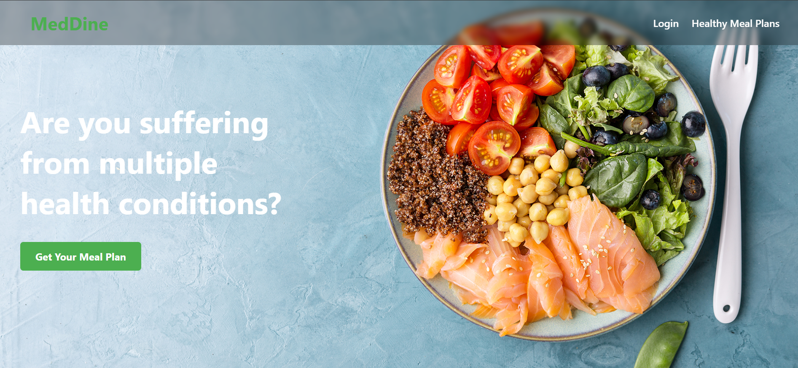

# 🥗 MedDine 🍽️

> Personalized disease-friendly meal planner built with Django.

MedDine is an intelligent meal planning web application that generates tailored meal plans for users based on their dietary preferences (Veg / Non-Veg) and medical conditions (diseases with forbidden ingredients).

It helps users eat healthier while respecting their medical needs – designed to support better lifestyle choices for people with diabetes, hypertension, allergies, etc.

---

## 🌟 Features

✅ User Registration & Login  
✅ Disease & Dietary Preference Selection  
✅ Personalized Meal Plan Generation  
✅ Public page showing all Healthy Meal Plans (recipes)  
✅ Admin dashboard to manage Meals, Ingredients, Diseases  
✅ Beautiful, responsive UI with background images 
✅ Nutrition charts, preparation steps for each meal  

---

## 🖼️ Screenshot

Home Page:

---

## 🚀 Tech Stack

- **Backend:** Django 4.2
- **Frontend:** Django Templates, CSS
- **Database:** MySQL

---

